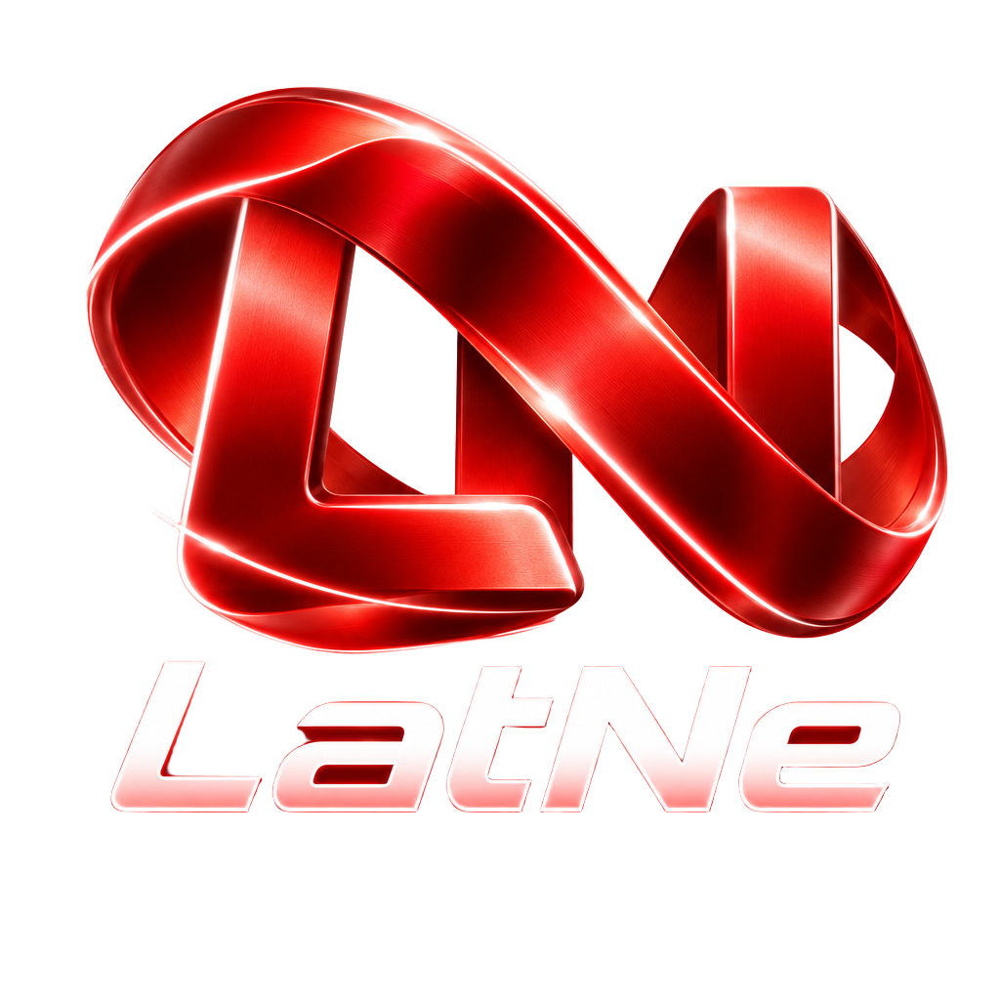

# LatNe

<table>
  <tr>
    <td width="44%" align="center">
      
    </td>
    <td width="56%">
      <pre><code>eksportē asinhroni darbība ielādēLietotājus() {
  nemainīgs dati =
    gaidi lasiDatus("lietotaji.json")

  kam (nemainīgs ieraksts ar dati) {
    ja (ieraksts.vārds == nekas) {
      turpini
    }
  }

  atgriez dati
}</code></pre>
    </td>
  </tr>
</table>

<h2 align="center">Programmē latviski.</h2>

<p align="center">
  LatNe ir neatkarīga latviska programmēšanas valoda un topošā izstrādes vide, kur latviešu valoda nav dekorācija — tā ir programmēšanas pieredzes pamats.
</p>

LatNe ir neatkarīga atvērtā pirmkoda programmēšanas valoda un topošā izstrādes vide, kur latviešu valoda nav tikai dokumentācijas slānis — tā ir pašas programmēšanas pieredzes daļa.

LatNe tiek veidota kā patstāvīga sistēma ar savu terminoloģiju, sintaktisko analīzi, AST, diagnostiku un izstrādes rīkiem.

> Projekts ir aktīvā izstrādē. LatNe vēl nav gatava gala lietošanai, bet valodas kodols jau reāli apstrādā `.lat` avota kodu.

[Projekta lapa](https://qvarcy.github.io/LatNe/) ·
[Ceļa karte](ROADMAP.md) ·
[Pašreizējais statuss](docs/STATUSS.md) ·
[Līdzdarboties](CONTRIBUTING.md)

---

## Kas jau darbojas

Pašreizējā LatNe ķēde:

```text
.lat avots
↓
terminoloģijas reģistrs
↓
Unicode leksiskais analizators
↓
deklarāciju sintaktiskais analizators
↓
priekšrakstu sintaktiskais analizators
↓
izteiksmju sintaktiskais analizators
↓
strukturēts AST
```

Šobrīd projektā jau ir:

- 84 cilvēka vadīti un apstiprināti LatNe termini;
- kanonisks terminoloģijas reģistrs;
- Vārdu kalve terminoloģijas pārvaldībai;
- Unicode leksiskais analizators;
- augšējā līmeņa deklarāciju sintaktiskais analizators;
- darbību ķermeņu priekšrakstu sintaktiskais analizators;
- atsevišķs izteiksmju sintaktiskais analizators;
- pirmie strukturētie AST mezgli;
- publiska arhitektūras un ADR sistēma;
- reproducējams projekta attīstības žurnāls un hronika.

Pirmais pilnais `.lat` paraugs pašlaik tiek leksiski analizēts kā:

```text
196 leksiskie elementi
0 nezināmu simbolu
5 augšējā līmeņa AST mezgli
```

---

## Kā izskatās LatNe

```lat
eksportē asinhroni darbība ielādēLietotājus(): objekts[] {
  mēģini {
    nemainīgs dati = gaidi lasiDatus("lietotaji.json")
    lai lietotāji: objekts[] = []

    kam (nemainīgs ieraksts ar dati) {
      ja (ieraksts.vārds == nekas) {
        turpini
      }

      lai lietotājs = jauns Lietotājs(
        ieraksts.vārds,
        ieraksts.vecums
      )

      lietotāji.push(lietotājs)
    }

    atgriez lietotāji
  }
  ķer (kļūda) {
    met jauns Kļūda(`Neizdevās ielādēt lietotājus: ${kļūda}`)
  }
}
```

`push` un citi ārējās izpildvides API nosaukumi šobrīd vēl ir zināmi pārejas elementi.

LatNe standarta API slānis tiks veidots semantiski — nevis ar aklu teksta aizvietošanu.

---

## Pašreizējais darbs

**Fāze 0A — reproducējama vide un kvalitātes pārbaudes — ir pabeigta.**

Pašreizējais valodas darbs ir **Fāze 1 — valodas kodols līdz AST v1**.

Jau strukturēts:

- klases ķermenis;
- klases lauki un pieejamības modifikatori;
- `nemaināms` lauki un to tipi;
- konstruktora deklarācija un parametri;
- konstruktora ķermeņa priekšraksti;
- iegūšanas deklarācija, atgriezes tips un ķermenis;
- minimāls klases metodes AST;
- metodes pieejamība, tipēti parametri, atgriezes tips un ķermenis;
- piešķiršanas izteiksmes;
- augšējā līmeņa `Darbība` parametri ar kopīgu `Parametrs` AST kontraktu;
- veidņu literāļi ar strukturētām teksta daļām un interpolāciju izteiksmēm.

Konstruktors, klases metode un augšējā līmeņa `Darbība` tagad izmanto vienu kopīgu parametru analizatoru.

Veidņu interpolācijas izmanto pilno izteiksmju AST, bet veidnes `pieraksts` vērtība tiek saglabāta saderībai un diagnostikai.

Konstruktora, iegūšanas un klases metodes neapstrādātie ķermeņa leksiskie elementi pagaidām tiek saglabāti kā pārejas lauki.

Pirmkoda diapazoni tagad ir ieviesti visiem pašreizējiem AST mezglu tipiem un pārklāti ar regresijas auditu.

**Nākamais konkrētais uzdevums ir definēt AST mezglu obligātos un izvēles laukus.**

Pēc tam tiks publicēts pirmais `spec/ast-v1.md`, pievienotas AST v1 paraugu pārbaudes un stabilizēts AST v1 kontrakts.

## Galvenais tuvākais mērķis

Panākt pirmo pilno LatNe programmas izpildes ķēdi:

```text
.lat
↓
leksiskais analizators
↓
sintaktiskais analizators
↓
AST v1
↓
semantiskās transformācijas
↓
koda ģenerators
↓
JavaScript starprezultāts
↓
izpilde
↓
LatNe CLI
```

Mērķa komanda:

```text
latne palaist sveika.lat
```

Brīdis, kad pirmā `.lat` programma tiks palaista caur šo ķēdi, būs viens no galvenajiem LatNe projekta atskaites punktiem.

---

## AST nav tikai starprezultāts

LatNe AST tiek veidots kā dokumentēts kontrakts starp sintaktisko analizatoru un nākamajiem kompilācijas posmiem.

Pirms nopietnas koda ģenerēšanas tiks stabilizēts **AST v1**, kas definēs:

- mezglu tipus;
- obligātos un izvēles laukus;
- pirmkoda diapazonus;
- kanoniskās identitātes robežas;
- strukturēta AST un pagaidu neapstrādātu leksisko elementu robežu.

Skatīt:

[`ADR 0007 — AST v1 ir koda ģeneratora kontrakts`](docs/adr/0007-ast-v1-ir-codegen-kontrakts.md)

---

## LatNe API

Latviska programmēšanas pieredze nebeidzas pie atslēgvārdiem.

Piemēram, pašreizējā paraugā vēl sastopami:

```text
Array.push
Array.length
```

Pirmie izskatāmie LatNe API kandidāti ir:

```text
pievieno
garums
```

Tie netiks ieviesti ar globālu string replacement.

API terminam jābūt sasaistītam ar konkrētu tipu un semantisku operāciju.

---

## Mācies ar LatNe

LatNe ilgtermiņa mērķis ir padarīt programmēšanas pamatjēdzienus pieejamākus arī cilvēkiem, kuri tos pirmo reizi apgūst latviešu valodā.

Plānotais mācību virziens ietver:

- īsu pirmās programmas ceļu;
- skolēnu uzdevumus;
- skolotāja materiālus;
- publisku playground;
- sasaisti starp LatNe terminiem un universāliem programmēšanas jēdzieniem.

**Šis vēl nav gatavs produkts.**

Education MVP tiks sākts pēc tam, kad valodas kodols, CLI un dokumentācijas minimums būs reāli lietojams.

---

## Būvē ar LatNe

LatNe ir arī atvērts tehnisks projekts cilvēkiem, kurus interesē:

- programmēšanas valodu izstrāde;
- sintaktiskie analizatori un AST;
- kompilatora arhitektūra;
- Unicode;
- programmēšanas terminoloģija;
- izstrādes rīki;
- diagnostika;
- valodu tehnoloģijas.

Projekta arhitektūras mērķis ir saglabāt skaidras robežas starp terminoloģiju, sintaktisko analīzi, semantiku, koda ģenerēšanu un izstrādes rīkiem.

Skatīt:

[`docs/ARHITEKTURA.md`](docs/ARHITEKTURA.md)

---

## Projekta ceļa karte

Aktuālais publiskais plāns:

[`ROADMAP.md`](ROADMAP.md)

Tas ir sakārtots faktiskā izpildes secībā:

```text
projekta pamats
↓
kvalitātes sliedes
↓
AST v1
↓
LatNe API minimums
↓
pirmā .lat izpilde
↓
CLI un diagnostika
↓
izstrādātāja pieredze
↓
bilingvāla dokumentācija
↓
Education MVP
↓
web un plašāka izstrādes vide
```

Publiskais progresa procents tiek rēķināts no pašreiz definētajiem `ROADMAP.md` uzdevumiem.

Paplašinoties projekta izpratnei, kopējais uzdevumu skaits var mainīties.

Tas nav absolūts “LatNe ir gatava X%” vērtējums.

---

## Projekta principi

### Latvian-first

Latviešu valoda ir projekta sākumpunkts, nevis vēlāk pievienots tulkojums.

### Neatkarīga sistēma

Ārējas bibliotēkas un izpildvides komponentes drīkst būt tehniski būvbloki, bet tās nenosaka LatNe identitāti vai publisko arhitektūru.

### Semantika pirms teksta aizvietošanas

LatNe nav veidota kā masveida JavaScript atslēgvārdu pārtulkošana.

Terminoloģija, sintaktiskā analīze un nākotnes API tiek modelēti strukturēti.

### Dokumentēta evolūcija

Būtiski lēmumi, kļūdas, atklājumi un pagriezieni tiek saglabāti kopā ar kodu.

---

## Dokumentācija

Sāc šeit:

[`docs/ATSAKSANA.md`](docs/ATSAKSANA.md)

Galvenie dokumenti:

- [`docs/STATUSS.md`](docs/STATUSS.md) — faktiskais tehniskais stāvoklis;
- [`ROADMAP.md`](ROADMAP.md) — publiskā izpildes secība;
- [`docs/ARHITEKTURA.md`](docs/ARHITEKTURA.md) — valodas arhitektūra;
- [`docs/LEMUMI.md`](docs/LEMUMI.md) — ADR indekss;
- [`docs/HRONIKA.md`](docs/HRONIKA.md) — cilvēkam lasāmais projekta stāsts;
- [`docs/ZURNALS.md`](docs/ZURNALS.md) — detalizētais tehniskais žurnāls;
- [`docs/KLUDAS-UN-ATKLAJUMI.md`](docs/KLUDAS-UN-ATKLAJUMI.md) — kļūdas un mācības;
- [`CHANGELOG.md`](CHANGELOG.md) — izmaiņu robežas.

---

## Līdzdarboties

LatNe vēl ir agrīnā stadijā, tāpēc vērtīgs ir ne tikai kods.

Noder:

- ieguldījumi sintaktiskajā analizatorā un kompilatorā;
- testi un paraugi;
- dokumentācija;
- terminoloģijas argumenti;
- piemēri;
- kļūdu apraksti;
- arhitektūras diskusijas.

Darba principi un pirmie soļi:

[`CONTRIBUTING.md`](CONTRIBUTING.md)

GitHub Issues:

[github.com/QvarcY/LatNe/issues](https://github.com/QvarcY/LatNe/issues)

---

## Atbalsts

Ja LatNe šķiet interesants, projektu vari atzīmēt GitHub un sekot tā attīstībai.

Finansiāli projekta izstrādes laiku iespējams atbalstīt arī šeit:

[Atbalstīt projektu](https://buymeacoffee.com/craftin)

---

## Projekta identitāte

| | |
|---|---|
| Nosaukums | **LatNe** |
| Avota faili | **`.lat`** |
| CLI | **`latne`** |
| Licence | **MIT** |
| Projekts uzsākts | **2026-09-30** |
| Projekta lapa | **https://qvarcy.github.io/LatNe/** |
| GitHub | **QvarcY/LatNe** |

---

**Programmē latviski.**
